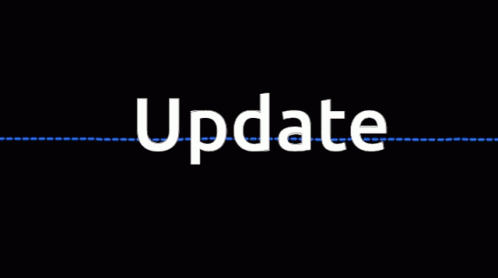

# Work Flow

## Creating Project

### Project Setup
- npm createvite@latest
  - Project Name: - ecomm-frontend
  - Module:- TypeScript + SWC
- cd .\ecom-frontend\
- npm install
- Intial setup Completed

### Package Installations 

- npm i react-hot-toast react-icons sass firebase react-router-dom react-table
- npm i --save-dev @types/react-table
- npm install --save chart.js react-chartjs-2

### Work Flow

<<<<<<< HEAD
- Updating soon 
=======
- Updating soon
- 
>>>>>>> ed6dfbae3f8fd718a073bbba5efeec78d6b3e698
